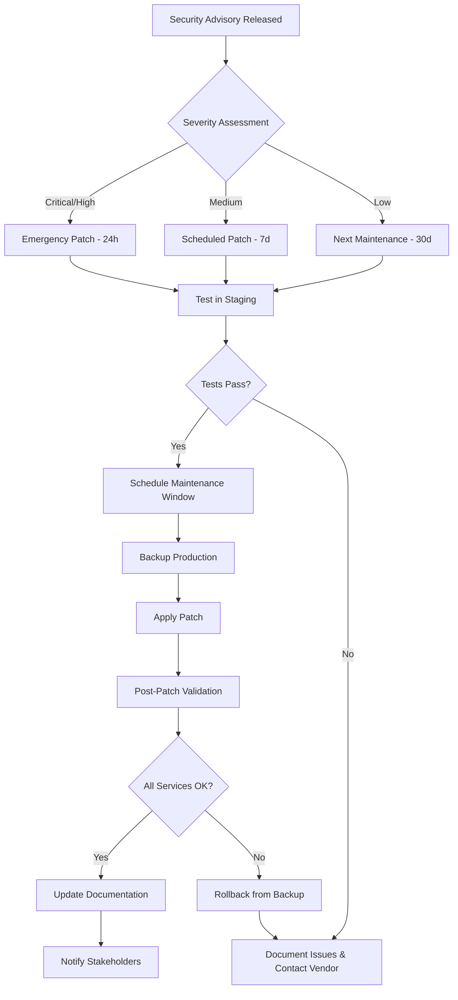

Pattern - Secured VPC

```
↓ NAT Gateway
↓ [Secrets Manager / HashiCorp Vault]
↓ Transit Gateway
↓ Production VPC (with strict SGs)
```


```
┌─────────────────────────────────────────────────────────┐
│                     Internet                             │
└────────────────────────┬────────────────────────────────┘
                         │
                    [CloudFlare]
                         │
                     [DDoS Protection]
                         │
                    [WAF Layer]
                         │
                  ┌──────┴──────┐
                  │  Reverse    │
                  │   Proxy     │ ← Rate limiting, SSL termination
                  │             │
                  └──────┬──────┘
                         │
                  ┌──────┴──────┐
                  │   Auth      │
                  │   Service   │ ← SSO/SAML, MFA
                  │             │
                  │             │
                  └──────┬──────┘
                         │
        ┌────────────────┼────────────────┐
        │                │                │
┌───────▼───────┐ ┌──────▼──────┐ ┌──────▼──────┐
│  n8n/Flowise  │ │   API       │ │   Admin     │
│   Platform    │ │  Gateway    │ │   Portal    │
│  (DMZ VPC)    │ │             │ │             │
└───────┬───────┘ └──────┬──────┘ └─────────────┘
        │                │
        └────────┬───────┘
                 │
          ┌──────▼──────┐
          │  Credential │
          │   Vault     │ ← HashiCorp Vault / AWS Secrets
          │             │
          └──────┬──────┘
                 │
    ┌────────────┼────────────┐
    │            │            │
┌───▼───┐  ┌─────▼─────┐  ┌──▼────┐
│  AWS  │  │  Database │  │GitHub │
│  API  │  │  (Prod)   │  │  API  │
└───────┘  └───────────┘  └───────┘


Monitoring Layer :
┌─────────────────────────────────────┐
│ SIEM → Threat Detection → Alerting  │
└─────────────────────────────────────┘
```


```
/client_deliverables/
├── architecture_diagrams/
│   ├── current_state.pdf
│   ├── target_state.pdf
│   └── data_flow.pdf
├── runbooks/
│   ├── incident_response.md
│   ├── patch_management.md
│   └── backup_recovery.md
└── documentation/
    ├── admin_guide.pdf
    ├── security_assessment.pdf
    └── compliance_mapping.xlsx
```


```
Internet → WAF → Reverse Proxy → Workflow Platform (DMZ)
                                       ↓
                                  API Gateway
                                       ↓
                              Internal Services (Prod)
```


### **Patch Management Process**



**Custom Metrics to Track**:

```prometheus
# Failed authentication attempts
workflow_auth_failures_total{platform="n8n|flowwise"}

# Workflow execution by user
workflow_executions_total{user="username", platform="n8n|flowwise"}

# Credential access
credential_access_total{credential="name", user="username"}

# Path traversal attempts blocked
security_blocks_total{type="path_traversal", platform="n8n"}

# API endpoint access patterns
api_requests_total{endpoint="/api/v1/...", method="POST|GET"}
```
